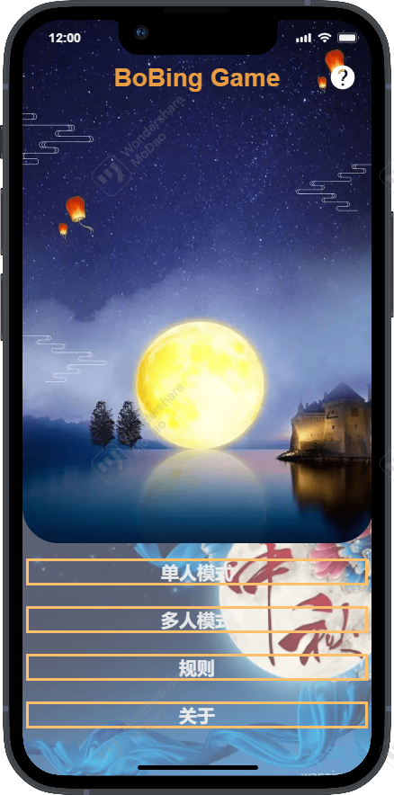
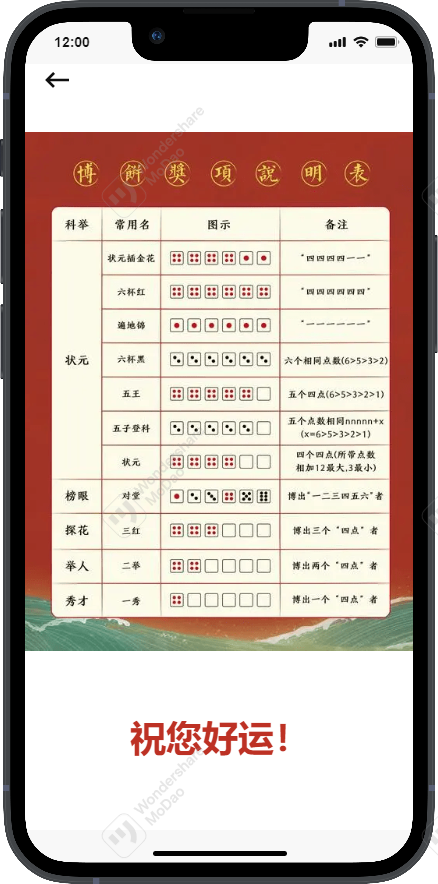
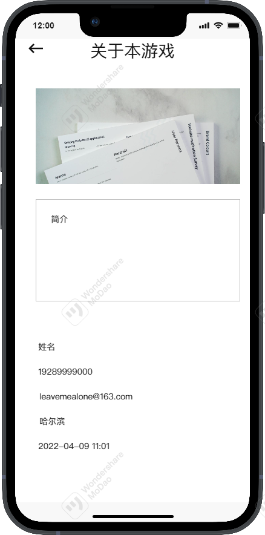
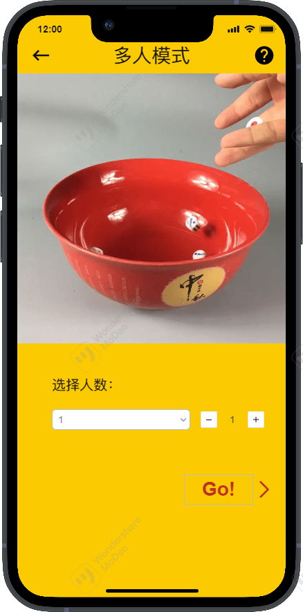
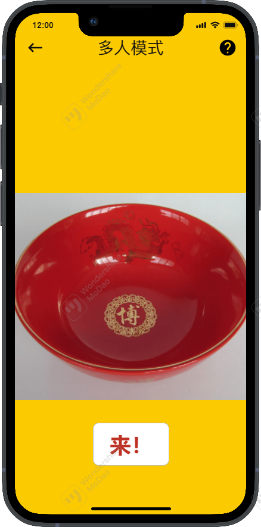
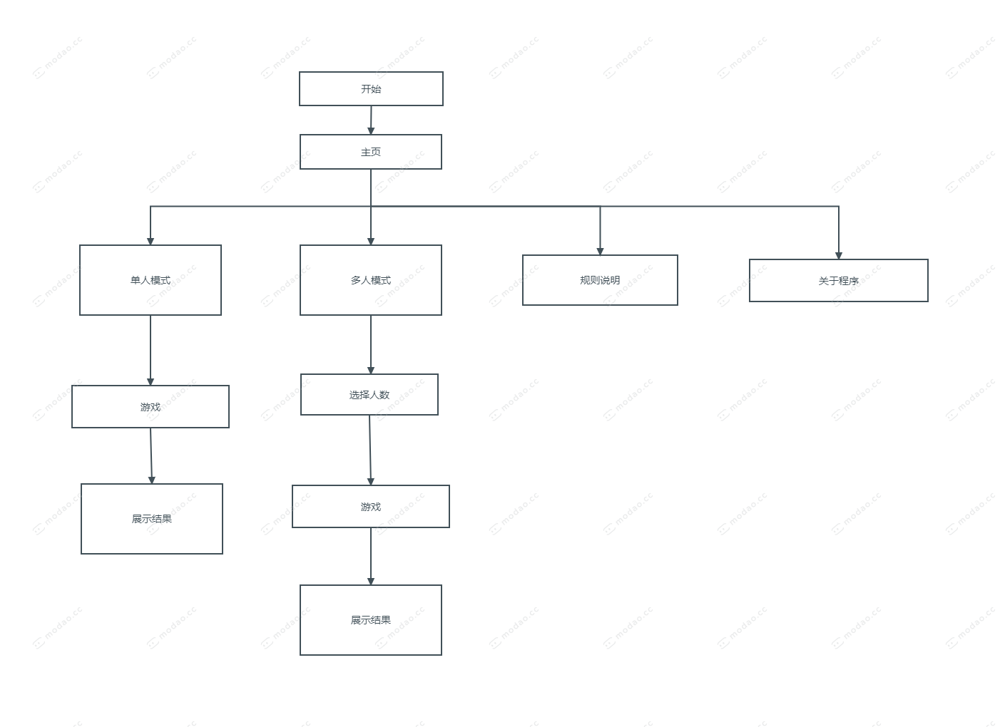

# Lab2-1 Bobing Prototype Blog

This page provides best reading experience in the sequence of:

1. *Typora*(md)
2. Github.com(HTML)
3. Github.com(md)
4. CSDN.net

Links provided in the [End](#End) Section.

## Contents

[toc]

## PSP Table

[Top](#Contents)

| **Stages** | **Estimated Time Cost** | **Actual Time Cost** |
|---:|:---:|:---:|
| **Planning** |  |  |
| Estimate | 10 | 10 |
| **Development** | | |
| Analysis | 15 | 15 |
| Design Spec | 15 | 15 |
| Design Review | 10 | 10 |
| Coding Standard | 10 | 5 |
| Design |40||
| Coding |300||
| Code Review |45||
| Test |20||
| **Report** |||
| Test Report |15||
| Size Measurement |10||
| Postmortem&Process Improvement |15||
| **Total** |505| |

## Demand Analysis

[Top](#Contents)

This analysis is based on ***NABCD* model**.

1. [**N**eed](#Need)
2. [**A**pproach](#Approach)
3. [**B**enefit](#Benefit)
4. [**C**ompetition](#Competition)
5. [**D**elivery](#Delivery)

### Need

[Top](#Contents) [NABCD](#Demand Analysis)

It's because the epidemic occurring worldwide that people can't get in touch with each other in the flesh and many activities are greatly affected even cancelled. This year's *Mid-Autumn Festival* holds the game '*Bobing*' as usual. And only goes online can it be hold as expected. So here is going to develop an online '*Bobing*' game for Chinese people and friends over the world. 

### Approach

[Top](#Contents) [NABCD](#Demand Analysis)

First, we need a software for us to design a prototype of it. So we choose Modao to bulid the interface of the Bobing game. After we made a satisfing version, we will code for this prototype and achieve various functions. After all the main work are done, we will make some adjustments to our UI to make it more beautiful.

### Benefit

[Top](#Contents) [NABCD](#Demand Analysis)

Customers can take part in Bobing game on the line, reducing antiepidemic pressure in the meanwhile . And this game will bring people the pleasure of playing with relatives and friends.

### Competition

[Top](#Contents) [NABCD](#Demand Analysis)

We are making it good-looking and easy and fun to play with.

### Delivery

[Top](#Contents) [NABCD](#Demand Analysis)

It's an open source project and can be found on GitHub. As app sharing is easy nowadays, we're going to build Android App. We will also put the demo video on bilibili.

## Prototype Development

[Top](#Contents)

Link: https://modao.cc/app/rhlZzkKVrktt3hHjMQcUhe #博饼原型-分享  

Tool used: Modao（墨刀）

### Screenshots

   

  
    

## Flow Chart

[Top](#Contents)

## Pair Work

[Top](#Contents)

## Summary

[Top](#Contents)

In this period, we've learnt to design prototype before rushing into coding. And this huge change of mind is making us working with higher efficiency and building good products.

## End

[Top](#Contents)

| The Link Your Class                        | https://bbs.csdn.net/forums/MUEE308FZU202201 |
| ------------------------------------------ | -------------------------------------------- |
| The Link of Requirement of This Assignment | https://bbs.csdn.net/topics/608858956        |
| The Aim of This Assignment                 | Note the development processes.              |
| Student 1: MUID_FZUID                 | 20123850_832001217                           |
| Student 2: MUID_FZUID                 | 20124082_832001228                           |

Project on Github.com: https://github.com/LiuJiewenTT/ee308fz_lab2

URL on github.com of this passage(download): https://liujiewentt.github.io/ee308fz_lab2/blog.md 
URL on github.com of this passage(view with Github md): https://github.com/LiuJiewenTT/ee308fz_lab2/tree/main/blog.md

URL on github.com of this passage(view as html): https://liujiewentt.github.io/ee308fz_lab2/blog.html 
URL on csdn.net of this passage(view as html): https://bbs.csdn.net/topics/609001732

